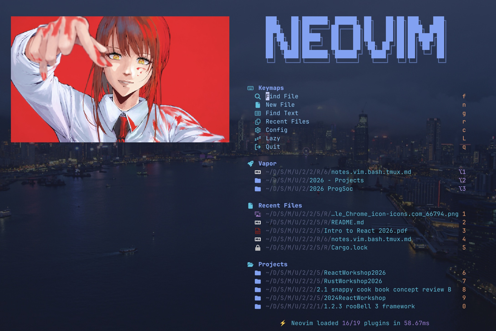
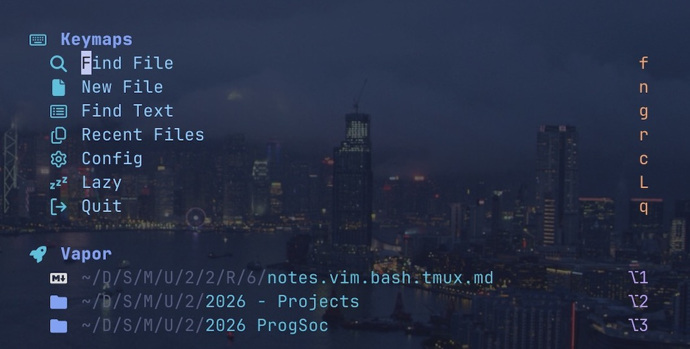

# Vapor.nvim


<div align="center">

</div>


Vapor lets you jump between files and directories instantaneously through Oil.
Vapor is a fixed-slot navigation for Neovim: pin a file or directory once, then
jump back to it instantly with `Option+1` through `Option+9`. 

I realised very late that it's very similar to Harpoon, with three deliberate
differences:

- slots never reorder, so their numbers become muscle memory;
- directories are first-class favorites and open in Oil;
- opening a favorite scopes Telescope to the relevant directory or Git root.

## Features

- Nine persistent file or directory slots by default.
- Alt/Option-number navigation with configurable terminal fallbacks.
- Oil integration for directory favorites, with a built-in fallback.
- Telescope file search rooted at any favorite.
- Snacks dashboard items with file and directory icons.
- Existing `favorites.json` files remain compatible.

## Installation

### LazyVim

Create `~/.config/nvim/lua/plugins/vapor.lua` with the following contents:

```lua
return {
    {
        "local-sailor/vapor.nvim",
        lazy = false,
        dependencies = {
            "stevearc/oil.nvim",
            "nvim-telescope/telescope.nvim",
        },
        opts = {},
    },
}
```

Restart Neovim or run `:Lazy sync` to install Vapor and its integrations.

For another lazy.nvim configuration, add the inner plugin specification to the
table passed to `require("lazy").setup()`.

Oil and Telescope are optional. Vapor falls back to Neovim's directory buffer
when Oil is unavailable, and only `:VprF` requires Telescope.

### Local development

To test a local checkout instead of the GitHub release:

```lua
return {
    {
        dir = "/absolute/path/to/vapor.nvim",
        name = "vapor.nvim",
        lazy = false,
        dependencies = {
            "stevearc/oil.nvim",
            "nvim-telescope/telescope.nvim",
        },
        opts = {},
    },
}
```

## Commands

| Command | Legacy aliases | Action |
| --- | --- | --- |
| `:VprFav` | `:Fav` | Pin the current file in the first free slot. |
| `:VprFav 3` | `:Fav 3` | Pin the current file in slot 3. |
| `:VprFav! 3` | `:Fav! 3` | Pin the current working directory in slot 3. |
| `:VprDel 3` | `:FavDel 3` | Clear slot 3. |
| `:VprLS` | `:FavList` | Display all slots. |
| `:VprF 3` | — | Open Telescope at slot 3's directory or Git root. |
| `:VprF` | — | Open Telescope at the current working directory. |

Legacy aliases are enabled by default and can be disabled with
`legacy_commands = false`.

## Configuration

```lua
require("vapor").setup({
    slots = 9,
    storage_path = vim.fn.stdpath("config") .. "/favorites.json",
    map_slots = true,
    legacy_commands = true,
})
```

<div align="center">

</div>


To show Vapor in a Snacks dashboard section:

```lua
{
    icon = " ",
    title = "Vapor Launchpad",
    indent = 2,
    padding = 1,
    require("vapor").dashboard_items,
}
```

## Data format

Vapor stores an object keyed by slot number so empty slots never collapse:

```json
{
  "1": { "path": "/path/to/project", "kind": "dir" },
  "3": { "path": "/path/to/project/README.md", "kind": "file" }
}
```

Run `:help vapor` after installation for the compact reference.
